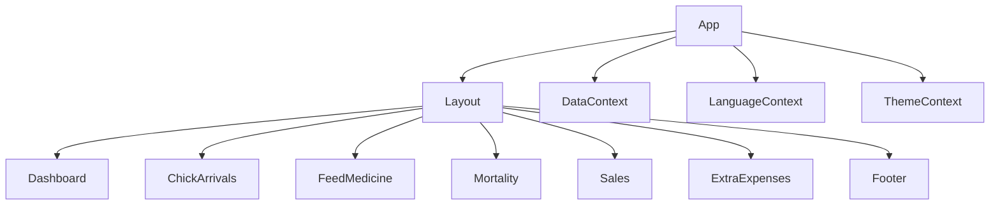
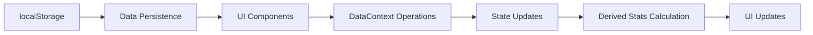

# Poultry Farm Management App - Codebase Analysis

## Overview
A comprehensive poultry farm management application built with React and TypeScript. The application provides features for managing various aspects of poultry farm operations including chick arrivals, feed and medicine tracking, mortality records, sales tracking, and expense management.

## Repository Type
Frontend Application (React + TypeScript)

## Architecture
The application follows a component-based architecture with React, utilizing context API for state management and localStorage for persistent data storage.


## Component Architecture
### Core Components



## Key Features

### 1. Chick Arrival Management
- Track chick arrivals with date, quantity, batch number, and source
- Add, edit, and delete arrival records
- View total chick count on dashboard

### 2. Feed and Medicine Tracking
- Record feed and medicine purchases separately
- Track date, type, name, quantity, cost, and supplier
- View expense breakdown on dashboard
- Visual representation in pie chart

### 3. Mortality Tracking
- Record daily mortality numbers
- Track date and quantity of deaths
- View mortality statistics on dashboard
- Calculate and display mortality rate

### 4. Sales Management
- Track sales with customer details
- Record date, customer name, quantity, price per unit, and payments
- Calculate and track outstanding balances
- View sales statistics and customer summaries

### 5. Expense Management
- Track additional expenses beyond feed and medicine
- Record date, description, and amount
- View total extra expenses on dashboard

### 6. Dashboard Analytics
- Comprehensive statistics display
- Interactive charts (bar chart and pie chart)
- Key performance indicators (KPIs) for all tracked metrics
- Real-time data visualization

## State Management
The application uses React Context API for state management with a centralized DataContext that provides:
- All data entities (chick arrivals, mortalities, feed/medicine, sales, expenses)
- CRUD operations for each entity
- Derived statistics calculated from raw data
- Data persistence through localStorage

## Data Models
### ChickArrival
```typescript
export interface ChickArrival {
  id: string;
  date: string;
  quantity: number;
  batchNumber: string;
  source?: string;
  createdAt: string;
}
```

### Mortality
```typescript
export interface Mortality {
  id: string;
  date: string;
  quantity: number;
  notes?: string;
  createdAt: string;
}
```

### FeedMedicine
```typescript
export interface FeedMedicine {
  id: string;
  date: string;
  type: 'feed' | 'medicine';
  name: string;
  quantity: number;
  cost: number;
  supplier?: string;
  createdAt: string;
}
```

### Sale
```typescript
export interface Sale {
  id: string;
  date: string;
  customerName: string;
  quantity: number;
  pricePerUnit: number;
  totalAmount: number;
  amountReceived: number;
  outstandingBalance: number;
  createdAt: string;
}
```

### DashboardStats
```typescript
export interface DashboardStats {
  totalChicks: number;
  totalMortality: number;
  currentStock: number;
  totalSales: number;
  totalRevenue: number;
  totalOutstanding: number;
  totalFeedCost: number;
  totalMedicineCost: number;
  mortalityRate: number;
  totalExpenses: number;
  perChickExpenses: number;
}
```

### ExtraExpense
```typescript
export interface ExtraExpense {
  id: string;
  date: string;
  description: string;
  amount: number;
  createdAt: string;
}
```

## Data Flow
The application follows a unidirectional data flow pattern:



## UI Components
Each feature is implemented as a standalone component that:
- Consumes data from context
- Provides user interface for data manipulation
- Handles form validation
- Implements responsive design
- Uses consistent styling and theming

## Technology Stack
- React with TypeScript
- React Router for navigation
- Tailwind CSS for styling
- Lucide React for icons
- Recharts for data visualization
- React Context API for state management
- localStorage for data persistence

## Testing Strategy
While no explicit test files were found in the provided structure, a comprehensive testing strategy would include:
- Unit tests for individual components
- Integration tests for component interactions
- End-to-end tests for user flows
- Snapshot tests for UI consistency
- Type checking with TypeScript

## Conclusion
The Poultry Farm Management App is a well-structured frontend application that provides comprehensive features for managing poultry farm operations. It uses modern React patterns with TypeScript for type safety and implements a clean component architecture with proper state management.


